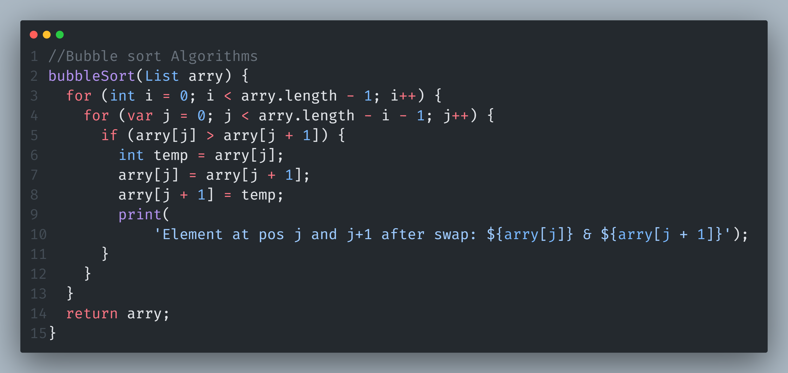

# Dart Algorithms 📚

Welcome to the Dart Algorithms repository! This repository aims to provide a collection of popular algorithms implemented in Dart programming language.

## Getting Started

1. Clone the repository:

```
git clone https://github.com/arrahmanbd/dart_algorithms
```


## What's included!

This Repo includes the following Algorithms:

- **Bubble Sort** 

- **Liner Search** 

- **Binary Search** 

- **QuickSort** 

- **Compare Sort** 
## Examples

<br>



## Contributing

Contributions are welcome! If you find a bug or have a feature request. You can open an issue or submit a pull request.

## 🔗 Follow
[](https://arrahmanbd.github.io/)
[](https://www.linkedin.com/in/arrahmanbd)
[](https://www.github.com/arrahmanbd)

## License

This project is licensed under the MIT License - see the [LICENSE](LICENSE) file for details.
